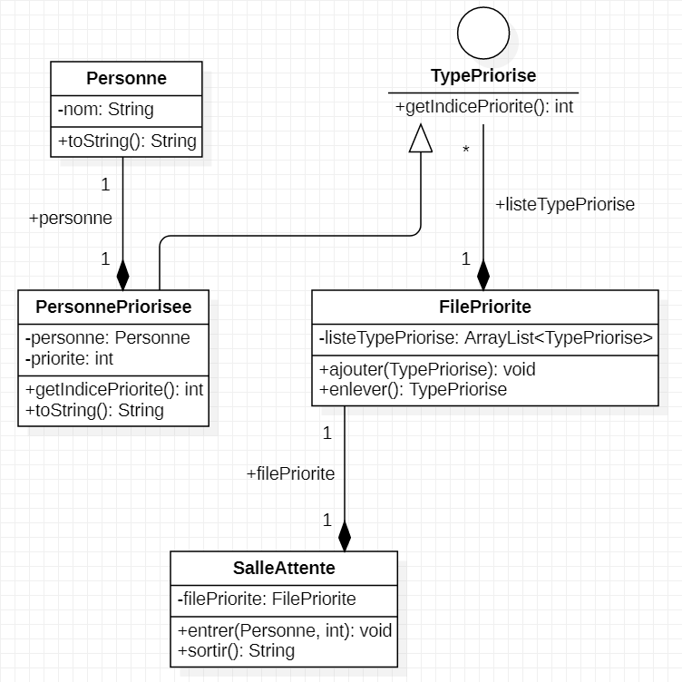

###Exercice 1

#####Question 5

#####Question 7

Afin de permettre une plus grande flexibilité dans ce programme je propose de créer une Interface de type FilePriorise.

Car, imaginons que un supérieur ou le client nous demande de faire en sorte de sortir la personne avec la plus grande priorité.
Dans notre cas actuel il faudrait refaire toute la classe FilePriorite.

C'est pourquoi le fait de créer une Interface qui s'appelle imaginons ``FileprioriseInterface`` qui contiendrait la méthode enlever() et ajouter() de la classe ``FilePriorite`` permettrait de faire en sorte que si on définit l'argument filePriorite de la classe ``salleAttente`` en tant que ``FileprioriseInterface`` il suffit juste de définir lorsque l'on en a besoin le type de ``filePriorite`` que l'on souhaite.

Dans le cas ci-dessus on initialiserai filePriorite en tant que ``FilePrioriteInverse`` qui serait une classe permettant de choisir la priorité la plus élevé dans enlever().

Et ``FilePrioriteInverse`` et ``FilePriorite`` implement bien évidemment ``FileprioriseInterface``.